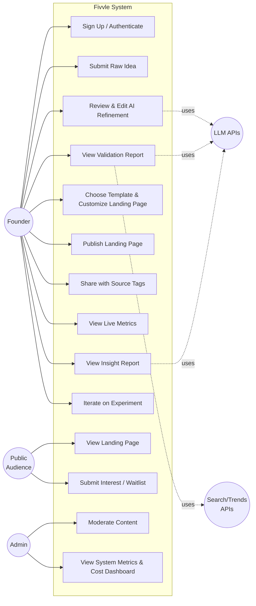
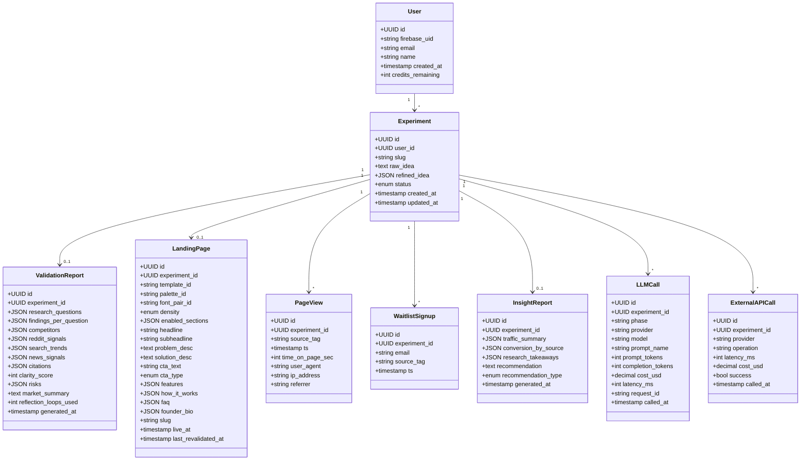
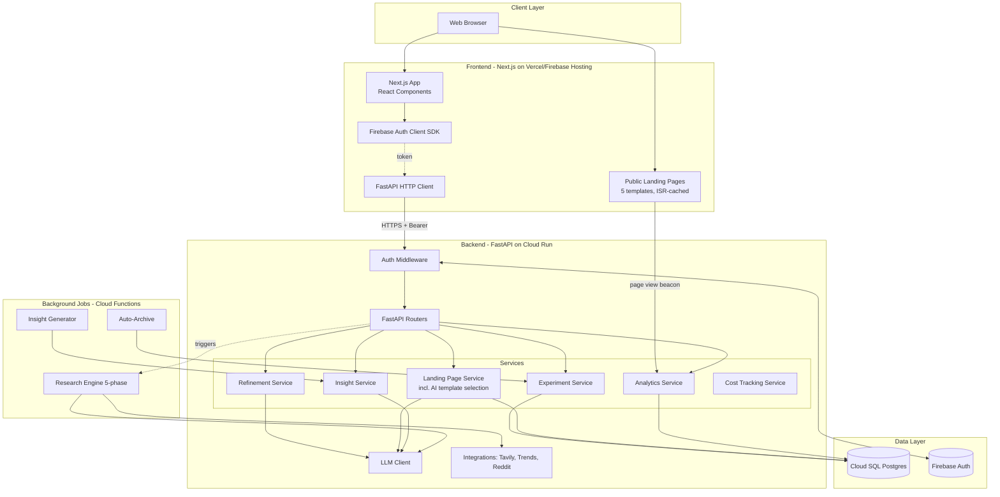
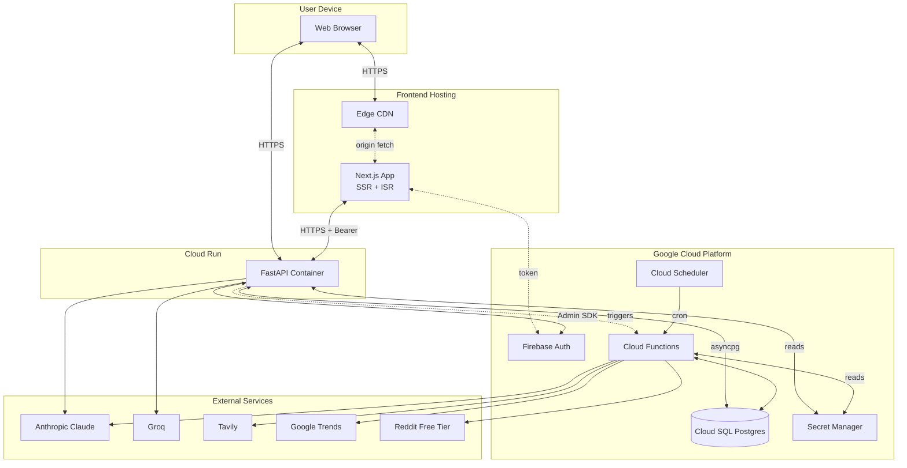
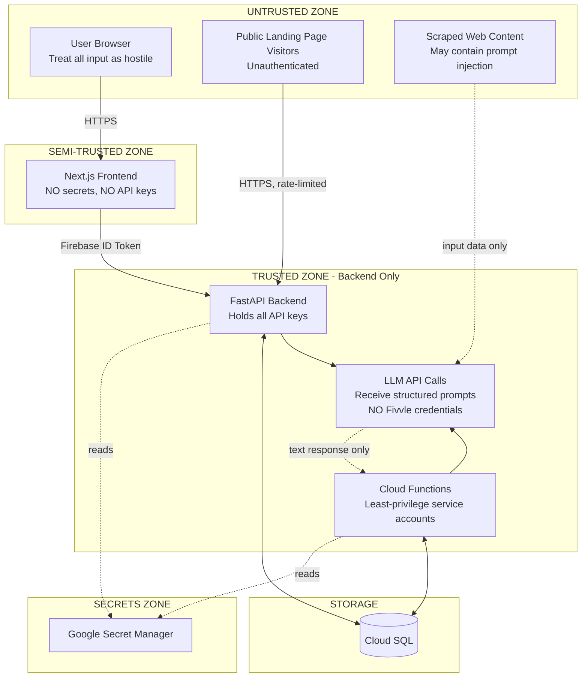
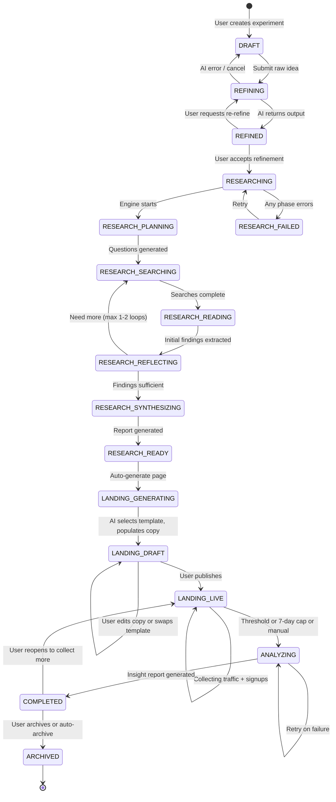
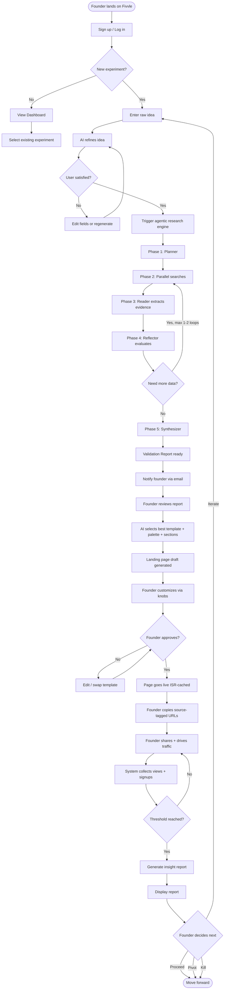
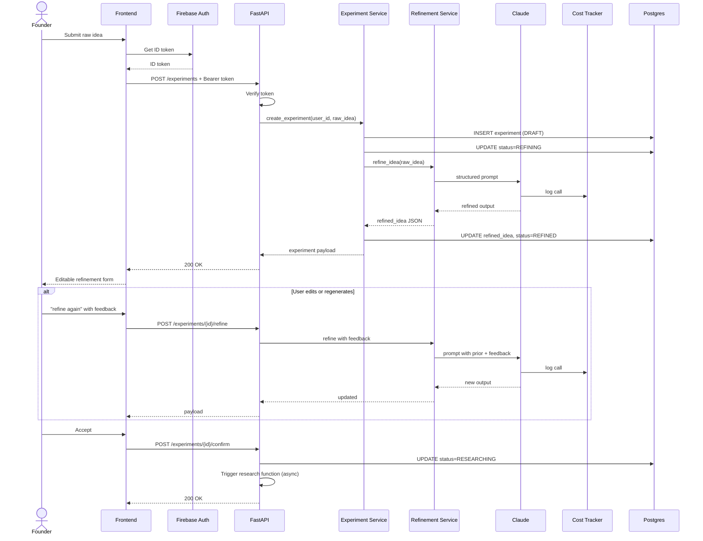
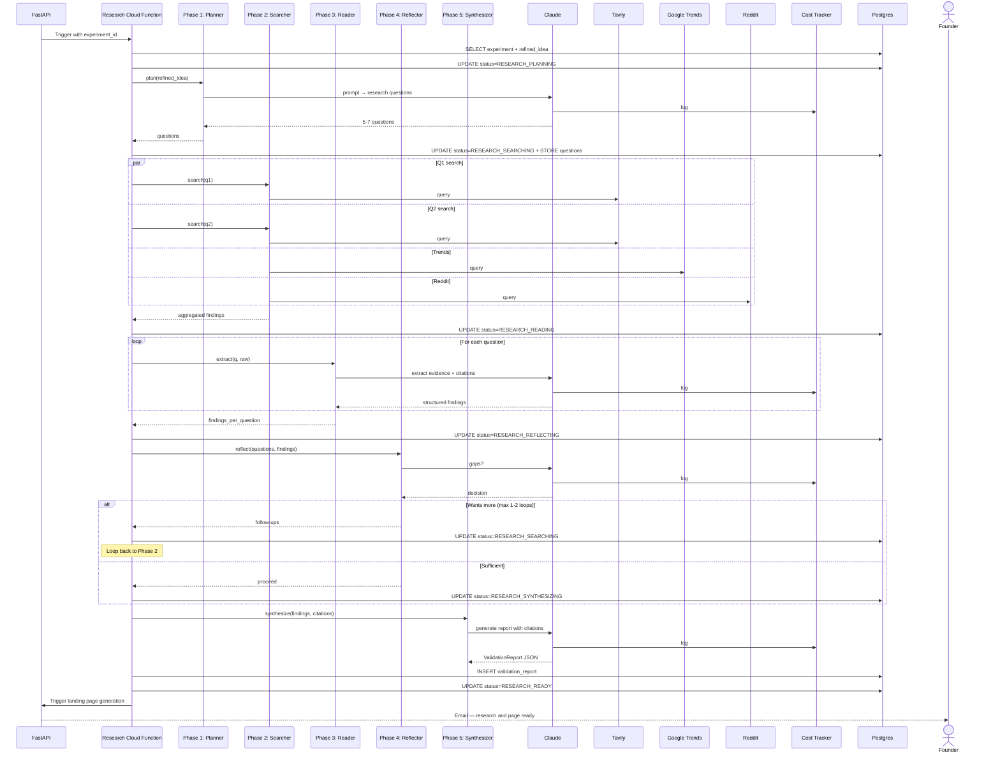
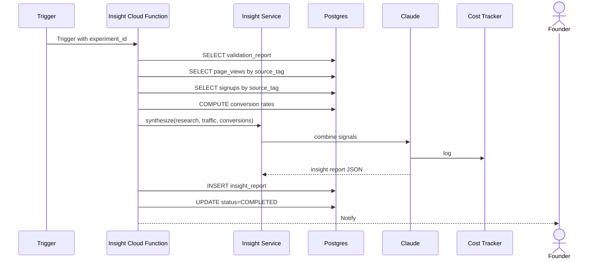

# Fivvle.io — MVP Architecture & UML Diagram Pack

**Version:** MVP 2.3 (final pre-build)
**Audience:** Engineering team (CTO/AI lead, backend co-founder, marketing/design lead, future hires)

All diagrams are written in Mermaid syntax. They render natively in GitHub, GitLab, Notion, VS Code (with the Mermaid extension), Obsidian, and most modern documentation platforms.

---

## MVP Scope (read this first)

**In scope:**
- AI idea refinement (cognitive validation)
- AI research engine — multi-step agentic workflow with 5 phases (planner, searcher, reader/extractor, reflector, synthesizer)
- Validation report with structured findings and citations
- Auto-generated, hosted, tracked landing pages (5 designer-built templates with bounded customization, ISR-cached)
- Page view + source tag + waitlist signup tracking
- Insight report combining research + landing page behavior
- Cost tracking infrastructure

**Out of scope for MVP (deferred):**
- Multi-platform video posting (Instagram, YouTube)
- Comment harvesting and AI comment analysis
- Pitch video upload and storage
- Social account OAuth
- Phone verification
- Payments — free for everyone in MVP
- Reddit posting (read-only research only)
- TikTok integration
- Custom domains per landing page
- Free-form HTML/CSS template editing
- AI-generated landing page layouts (templates with bounded customization only)
- Phase 2 research enhancements (Exa, Firecrawl, deep multi-loop reflection)

---

## Architectural Decision Record: Modular Monolith over Microservices

**Decision:** Fivvle MVP uses a modular monolith architecture, with targeted process-level extraction for long-running background jobs only.

**Status:** Decided May 2026.

**Rationale:**
- Microservices solve problems we don't have at our scale (independent team deploys, polyglot stacks, compliance boundaries)
- Microservices add costs we cannot afford (distributed system complexity, eventual consistency, 5-10x operational overhead, slower local dev, harder debugging)
- Real fault isolation comes from process separation for high-risk components, not splitting all services
- Industry precedent: Stripe, Linear, Notion, Shopify, Basecamp run modular monoliths at scales far larger than ours

**What we chose:**
- One FastAPI monolith on Cloud Run for user-facing API
- Cloud Functions for long-running background jobs (research engine, insight generator, auto-archive)
- One Postgres instance (Cloud SQL)
- Module boundaries inside the monolith enforced by code conventions
- Next.js frontend is its own deployment

**Process isolation:**

| Component | Process | Reason |
|---|---|---|
| Frontend (Next.js) | Vercel/Firebase Hosting | Different runtime, different scaling |
| Backend API (FastAPI) | Cloud Run | User-facing, low-latency |
| Research Engine | Cloud Function | 2-4 minute runs, must not block user requests |
| Insight Generator | Cloud Function | Background work, independent retry |
| Auto-archive | Cloud Function | Cron-driven |

**Triggers for future service extraction (NOT a microservices migration):**
- A specific component has fundamentally different scaling requirements
- A specific component has compliance boundaries
- Engineering team grows past 10+ engineers in independent product teams
- Production data shows a specific component as a recurring single point of failure

---

## Diagram Index

| # | Diagram | Purpose |
|---|---|---|
| 1 | Use Case Diagram | Actors and system boundaries |
| 2 | Class Diagram | Data model — implement as SQLAlchemy schema |
| 3 | Component Diagram | Software architecture |
| 4 | Deployment Diagram | Physical infrastructure |
| 5 | Trust Boundaries | Security boundaries between components |
| 6 | State Machine Diagram | Experiment lifecycle |
| 7 | Activity Diagram | End-to-end founder journey |
| 8a | Sequence — Idea refinement | Founder ↔ AI refinement loop |
| 8b | Sequence — Agentic research engine | Multi-phase research workflow |
| 8c | Sequence — Insight generation | Final report synthesis |

---

## 1. Use Case Diagram



---

## 2. Class Diagram



---

## 3. Component Diagram



---

## 4. Deployment Diagram



---

## 5. Trust Boundaries



**Trust boundary rules:**

| Boundary | Rule |
|---|---|
| Browser → Frontend | All user input treated as hostile |
| Frontend → Backend | Every authenticated request requires verified Firebase ID token |
| Backend → External APIs | API keys read from Secret Manager, never hardcoded |
| Backend → Database | Parameterized queries only |
| Cloud Function → Database | Least-privilege service accounts |
| LLM ← Scraped Content | Prompts treat scraped content as data, not instructions |
| LLM → System | LLMs return text, code decides actions, LLMs cannot call Fivvle endpoints |
| Frontend → External APIs | NEVER |
| Frontend → LLMs | NEVER (streaming through backend) |
| Frontend → Database | NEVER |
| Frontend secrets | NEVER (only Firebase client config, which is public identifiers) |

---

## 6. State Machine Diagram



---

## 7. Activity Diagram



---

## 8a. Sequence — Idea Refinement



---

## 8b. Sequence — Agentic Research Engine



---

## 8c. Sequence — Insight Generation



---

## Cost Tracking Architecture

`LLMCall` and `ExternalAPICall` tables capture every paid operation. Per-experiment cost rollups, per-user lifetime cost tracking, daily spend dashboards. Build from day one.

**Per-experiment cost target: under $1.50.**

Soft limits enforced in code:
- Max 5 refinement regenerations per experiment
- Max 5 landing page field regenerations per page
- Max 1-2 reflection loops in research engine
- Hard timeout on research engine: 6 minutes

---

## Landing Page Architecture (Final Plan)

### Template Catalog (5 templates for MVP)

| ID | Name | Best for | Mood |
|---|---|---|---|
| `minimal` | Minimal | B2B SaaS, productivity, dev tools | Confident, premium, understated |
| `vibrant` | Bold/Vibrant | Consumer, design-forward | Energetic, modern |
| `indie` | Indie | Solo founder projects, side projects | Authentic, approachable |
| `premium-dark` | Dark/Premium | Dev tools, AI products | Sleek, technical |
| `editorial` | Editorial | Content-first, social impact | Thoughtful, narrative |

### Props interface (every template implements this)

```typescript
// frontend/components/landing-templates/types.ts

export type LandingPageProps = {
  headline: string;
  subheadline: string;
  problem: string;
  solution: string;
  ctaType: 'waitlist' | 'interest' | 'contact';
  ctaText: string;
  palette: string;
  fontPair: string;
  density: 'compact' | 'roomy';
  features?: Array<{ title: string; description: string; icon?: string }>;
  howItWorks?: Array<{ step: number; title: string; description: string }>;
  faq?: Array<{ question: string; answer: string }>;
  founderBio?: { name: string; bio: string; photoUrl?: string; twitterHandle?: string };
  testimonials?: Array<{ quote: string; author: string; role?: string }>;
  poweredByFivvle: boolean;
  experimentSlug: string;
};

export type TemplateMetadata = {
  id: string;
  name: string;
  description: string;
  bestFor: string[];
  palettes: Array<{ id: string; name: string; preview: string }>;
  fontPairs: Array<{ id: string; name: string; preview: string }>;
  supportsSections: Array<'features' | 'howItWorks' | 'faq' | 'founderBio' | 'testimonials'>;
};
```

### AI's bounded role

ONE LLM call returns: `template_id`, `palette_id`, `font_pair_id`, `enabled_sections`, and copy for the additional sections (features, FAQ, how-it-works). Hero/problem/solution/CTA come from refinement.

### Customization model

Founder can: swap template, change palette, change font pair, toggle density, toggle optional sections, edit any text inline, click "regenerate this with AI" on any field (capped at 5 per page).

### Rendering

- Public landing pages use Incremental Static Regeneration (ISR)
- `revalidate: 60` and on-demand `revalidatePath()` on copy changes
- Cached at CDN edge

### Stack for templates

- React (Server Components default), Next.js 14+ App Router
- TypeScript strict mode
- Tailwind CSS only — no styled-components, no CSS modules, no plain CSS files
- No UI libraries (no shadcn/ui, Radix, Headless UI, MUI, etc.)
- Icons: `lucide-react` only
- Fonts: `next/font/google`
- Images: `next/image`
- Animations: Tailwind utilities first; Framer Motion only if needed
- Forms: plain HTML elements styled with Tailwind
- Accessibility: semantic HTML, alt text, keyboard-accessible, WCAG AA contrast

---

## How to use this document

1. **Open in Mermaid-compatible editor.** GitHub renders inline.
2. **Class Diagram → SQLAlchemy models.** Use Alembic for migrations.
3. **State Machine → Python Enum.** Match diagram exactly.
4. **Sequence Diagrams → API + service code.** When implementing, the diagram is the spec.
5. **Trust Boundaries → security review checklist.**
6. **Update as you build.** Living document.
