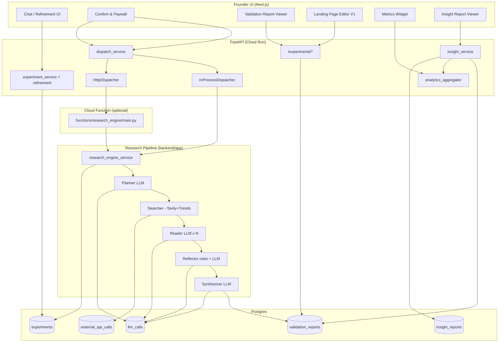
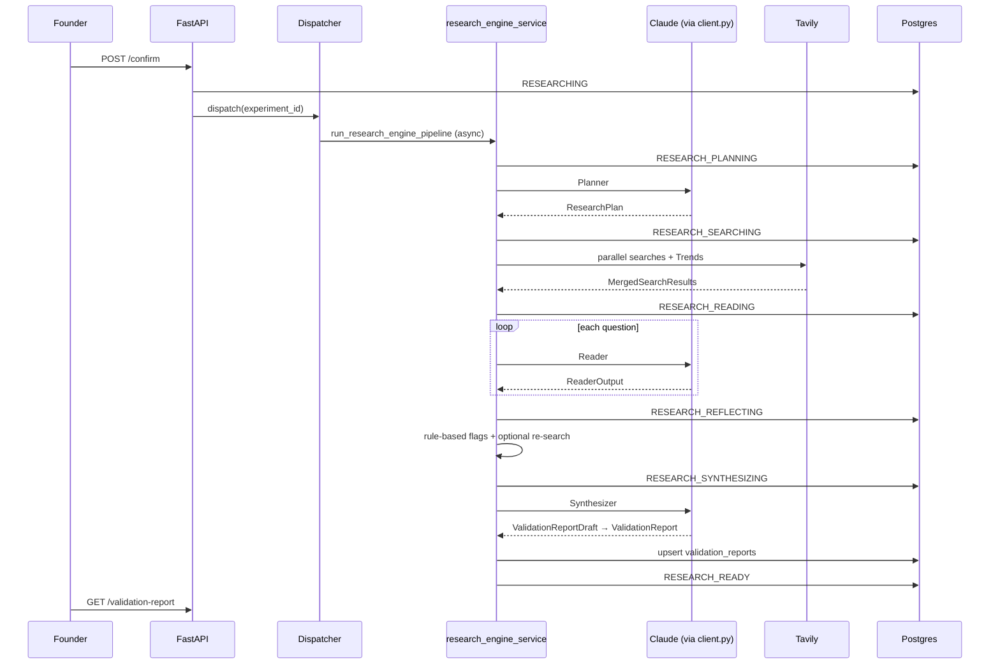

# Fivvle Research Engine & Report Generation — Complete Architecture Reference

**Purpose:** Hand this document to an LLM or teammate to reason about improvement opportunities.  
**Last updated:** 2026-06-29  
**Scope:** Cognitive validation pipeline (refinement → research → validation report) and behavioral synthesis (insight report). V1 template landing pages consume the validation report separately.

---

## Table of Contents

1. [Executive Summary](#1-executive-summary)
2. [System Map — How Everything Connects](#2-system-map--how-everything-connects)
3. [Experiment State Machine](#3-experiment-state-machine)
4. [Phase 0 — Idea Refinement (Pre-Research)](#4-phase-0--idea-refinement-pre-research)
5. [Research Trigger & Dispatch](#5-research-trigger--dispatch)
6. [Research Engine — Five Phases](#6-research-engine--five-phases)
7. [Validation Report (Output Contract)](#7-validation-report-output-contract)
8. [Insight Report (Cognitive + Behavioral)](#8-insight-report-cognitive--behavioral)
9. [Downstream Consumers of Reports](#9-downstream-consumers-of-reports)
10. [LLM & Cost Infrastructure](#10-llm--cost-infrastructure)
11. [External APIs](#11-external-apis)
12. [Frontend Surfaces](#12-frontend-surfaces)
13. [API Endpoints](#13-api-endpoints)
14. [Evaluation & Quality](#14-evaluation--quality)
15. [Architecture Decision Records](#15-architecture-decision-records)
16. [Known Gaps & Improvement Opportunities](#16-known-gaps--improvement-opportunities)
17. [Full Prompt Texts](#17-full-prompt-texts)

---

## 1. Executive Summary

Fivvle produces **two founder-facing reports**:

| Report | Producer | When | Storage |
|--------|----------|------|---------|
| **Validation Report** | Research engine **Synthesizer** (phase 5) | After `POST /experiments/{id}/confirm` | `validation_reports.raw_report` (JSONB) |
| **Insight Report** | **Insight service** (separate LLM call) | After landing page live + minimum behavioral data | `insight_reports.raw_output` (JSONB) |

The **research engine** is a **modular monolith** pipeline — not microservices, not LangGraph. Five sequential phases run in one Python codebase (`backend/app/`), optionally isolated in a **Cloud Function** for long runs.

**Critical path:**
```
Raw idea → Refinement (LLM) → RefinedIdea JSON
         → Confirm (API) → Dispatcher
         → Planner → Searcher → Reader → Reflector → Synthesizer
         → ValidationReport persisted → RESEARCH_READY
         → (later) Landing page + analytics
         → Insight generator → InsightReport
```

There is **no separate "report generator"** beyond Synthesizer (validation) and Insight service (insight).

---

## 2. System Map — How Everything Connects



### Key file locations

| Layer | Path |
|-------|------|
| Orchestrator (production) | `backend/app/services/research_engine_service.py` |
| Orchestrator (scripts/eval, no DB status) | `backend/app/services/research_engine.py` |
| Dispatch | `backend/app/services/dispatch_service.py`, `backend/app/dispatchers/` |
| Cloud Function wrapper | `functions/research_engine/main.py` |
| Phase services | `backend/app/services/{planner,searcher,reader,reflector,synthesizer}_service.py` |
| Prompts | `backend/app/llm/prompts/{planner,reader,reflector_query_refinement,synthesizer,insight,refinement}.py` |
| Schemas | `backend/app/schemas/{planner,reader,reflector,search,validation_report,insight,refinement}.py` |
| Synthesizer input builder | `backend/app/services/synthesizer_input.py` |
| Insight | `backend/app/services/insight_service.py` |
| Integrations | `backend/app/integrations/{tavily,trends,reddit}.py` |
| LLM wrapper | `backend/app/llm/client.py` |

**Note:** `backend/functions/research_engine/` does **not** exist. ADR docs sometimes reference an older layout.

---

## 3. Experiment State Machine

### Research sub-states (`backend/app/db/enums.py`)

```
REFINED
  → (POST /confirm) RESEARCHING
  → RESEARCH_PLANNING      # Planner
  → RESEARCH_SEARCHING     # Searcher
  → RESEARCH_READING       # Reader
  → RESEARCH_REFLECTING    # Reflector
  → RESEARCH_SYNTHESIZING  # Synthesizer
  → RESEARCH_READY         # validation_reports row written

Any unrecoverable phase error (except reflector degrade):
  → RESEARCH_FAILED + research_error_detail
```

### Insight sub-states

```
LANDING_LIVE + min data
  → (POST /generate-insight) INSIGHT_GENERATING
  → INSIGHT_READY | INSIGHT_FAILED
```

UI phase labels: `backend/app/services/research_phase_mapping.py`

---

## 4. Phase 0 — Idea Refinement (Pre-Research)

**Purpose:** Convert raw founder text into structured `RefinedIdea` JSON that feeds the Planner.

| Item | Detail |
|------|--------|
| Service | `backend/app/services/experiment_service.py` — `create_experiment_with_refinement`, `regenerate_refinement` |
| Prompt | `backend/app/llm/prompts/refinement.py` — `PROMPT_NAME = "refinement_v1"` (chat mode: `refinement_v2_chat_v2`) |
| Schema | `backend/app/schemas/refinement.py` — `RefinedIdea` |
| Storage | `experiments.refined_idea` (JSONB) |
| Status | `DRAFT → REFINING → REFINED` |
| Cap | 5 regenerations per experiment |

**RefinedIdea fields (Planner-critical):**
- `refined_one_liner`, `target_audience`, `value_proposition`, `wedge`, `category`
- `risks` — 3–5 investigable risk strings (Planner must derive ≥3 questions from these)

**Bridge to research:** `POST /confirm` requires `REFINED` or `RESEARCH_FAILED`. Pipeline loads `experiment.refined_idea` → `RefinedIdea.model_validate(...)`.

---

## 5. Research Trigger & Dispatch

### Entry: `transition_to_researching_and_dispatch`
**File:** `backend/app/services/dispatch_service.py`

| Trigger | Allowed source status |
|---------|----------------------|
| `USER_CONFIRM` | `REFINED`, `RESEARCH_FAILED` |
| `AUTO_FIRE` (chat ADR 0019) | `REFINED`, `REFINING` |

On dispatch: `status = RESEARCHING`, commit, then `dispatcher.dispatch(experiment_id)`.

### Dispatcher modes (`DISPATCHER_MODE` env)

| Mode | Implementation | Behavior |
|------|----------------|----------|
| `in_process` (default dev) | `InProcessDispatcher` | `asyncio.create_task(run_research_engine_pipeline)` in FastAPI process |
| `http` (staging/prod) | `HttpDispatcher` | POST JSON `{"experiment_id": "..."}` to `RESEARCH_ENGINE_URL` with GCP OIDC; 10s HTTP timeout |

### Cloud Function
**File:** `functions/research_engine/main.py`
- Validates UUID, starts background thread
- `asyncio.run(run_research_engine_pipeline(...))`
- Returns **202** immediately
- Deploy timeout: **540s**
- Deploy copies `backend/app/` into function bundle

---

## 6. Research Engine — Five Phases

### Orchestration pseudocode (`research_engine_service.py`)

```python
async def run_research_engine_pipeline(experiment_id, sessionmaker):
    load experiment.refined_idea → RefinedIdea
    await _set_status(RESEARCH_PLANNING)
    research_plan = await plan_research(db, refined_idea, experiment_id)

    await _set_status(RESEARCH_SEARCHING)
    search_results = await execute_search_plan(db, research_plan, experiment_id, refined_idea)

    await _set_status(RESEARCH_READING)
    reader_outputs = await execute_reader(...)

    await _set_status(RESEARCH_REFLECTING)
    reader_outputs, search_results, reflector_summary = await execute_reflector(...)

    await _set_status(RESEARCH_SYNTHESIZING)
    synth_input = build_synthesizer_input(refined_idea, research_plan, reader_outputs, trends)
    hydration_index = build_citation_hydration_index(...)
    report = await synthesize_report(db, synth_input, hydration_index, experiment_id)

    await _write_validation_report(...)  # upsert validation_reports
    await _set_status(RESEARCH_READY)
```

---

### Phase 1: Planner

| | |
|--|--|
| **Service** | `plan_research()` in `planner_service.py` |
| **Input** | `RefinedIdea` |
| **Output** | `ResearchPlan` — 5–7 `ResearchQuestion` (`id` q1–q7, `question`, `rationale`, `search_queries`) |
| **LLM** | 1× `complete_structured` → `ResearchPlan` |
| **Prompt** | `planner_v1_cached` — `backend/app/llm/prompts/planner.py` |
| **Model** | `settings.planner_provider` / `planner_model` (default anthropic / claude-sonnet-4-6) |
| **max_tokens** | 2048, temperature 0.5 |

**Business rules in prompt:**
- Coverage quotas: demand, user behavior, ≤2 competitor questions, market/trends, risks
- ≥3 questions must investigate `RefinedIdea.risks`
- Vague ideas → exactly 5 questions + `notes_for_synthesizer` honesty flag
- Search queries: 1–3 per question, 3–8 words, Tavily-ready

---

### Phase 2: Searcher

| | |
|--|--|
| **Service** | `execute_search_plan()` in `searcher_service.py` |
| **Input** | `ResearchPlan`, optional `RefinedIdea` |
| **Output** | `MergedSearchResults { tavily: dict[qid → list[TavilyResult]], trends: dict \| None }` |
| **LLM** | **None** |
| **Tavily** | Parallel `asyncio.gather` on all (question, query) pairs; `search_depth="advanced"`, `max_results=5`; dedupe URLs; top 10 per question |
| **Trends** | One `fetch_trends()` after Tavily; 1–5 keywords from plan; failure → `trends=None` |
| **Failure** | `SearcherFailure` if **all** Tavily calls fail |

**Reddit:** `backend/app/integrations/reddit.py` exists but is **NOT wired** into Searcher. Planner/Reader prompts encourage forum-style queries via Tavily only.

---

### Phase 3: Reader

| | |
|--|--|
| **Service** | `execute_reader()` in `reader_service.py` |
| **Input** | Per question: `ResearchQuestion` + `list[TavilyResult]`; also loads full `RefinedIdea` + plan for cache Zone B |
| **Output** | `dict[str, ReaderOutput]` — keyed by question id |
| **LLM** | 1 call per question (5–7 parallel, bounded by `reader_concurrency_limit` default 7) |
| **Prompt** | `reader_v2_cached` — `backend/app/llm/prompts/reader.py` |
| **Draft model** | `ReaderOutputDraft` → validated → `ReaderOutput` |
| **Guards** | URL allow-list; verbatim quote substring check; sentinels on LLM failure or >20% URL hallucination |
| **Failure** | `ReaderTotalFailure` if zero evidence across all questions |
| **Content truncate** | Tavily `content` truncated to 2000 chars per result in prompt |

**ReaderOutput structure:**
- `extracted_evidence[]` — `source_url`, `relevance`, `verbatim_quote?`, `paraphrase`, `named_entities`
- `evidence_gap_note?`

---

### Phase 4: Reflector

| | |
|--|--|
| **Service** | `execute_reflector()` in `reflector_service.py` |
| **Input** | `ResearchPlan`, reader outputs, search results |
| **Output** | Updated reader outputs + search results + `ReflectorPhaseSummary` |
| **LLM** | 0–4 calls per wave (only for flagged questions) |
| **Prompt** | `reflector_query_refinement_v1_cached` |
| **Rules** | Deterministic `rule_v1`: `gap_note`, `sparse_atoms` (≤2 evidence), `mono_domain`; max 4 questions/wave |
| **Waves** | `reflector_max_refinement_waves` (default 1, config) |
| **Re-search** | Partial Tavily fan-out with refined queries; re-read affected questions |
| **Failure policy** | **Never fails pipeline** — on error returns original inputs |

---

### Phase 5: Synthesizer (Validation Report Generator)

| | |
|--|--|
| **Service** | `synthesize_report()` in `synthesizer_service.py` |
| **Input** | `SynthesizerInput` + `citation_hydration_index` |
| **Output** | `ValidationReport` (via `ValidationReportDraft`) |
| **LLM** | 1× `complete_structured` |
| **Prompt** | **`synthesizer_v3_cached`** (active) — Trends-aware Zone C |
| **max_tokens** | 16384, temperature 0.3 |
| **Guards** | `_assert_draft_citations_allowlisted` — unknown URLs → `SynthesizerHallucinatedCitation` |
| **Hydration** | Draft URL strings → full `Citation` objects with title/domain from Reader/Tavily metadata |

**SynthesizerInput fields (`synthesizer_input.py`):**
- `refined_idea`, `research_plan`, `reader_outputs`, `rubric_version`, `trends_signals?`

**Synthesizer does NOT receive raw Tavily snippets** — only structured Reader evidence (ADR 0012).

---

## 7. Validation Report (Output Contract)

### Pydantic schema
**File:** `backend/app/schemas/validation_report.py`

**Top-level `ValidationReport` fields:**
- `executive_summary`
- `questions_and_findings: list[QuestionFindings]` (5–7, aligned to plan)
- `competitors: list[CompetitorMention]` (0–6)
- `market_signals`, `distribution_signals?`, `regulatory_signals?`
- `risks_assessment` (must address every `RefinedIdea.risk`)
- `overall_recommendation`: `proceed | iterate | pivot | kill | too_vague_to_recommend`
- `recommendation_rationale`, `research_limitations`
- `rubric_version_used`
- `section_scores` (6 dimensions: market, competition, distribution, regulatory, risk, research)
- `overall_score` (0–100)

**Finding structure:**
- `claim`, `evidence_summary`, `citations[]`, `confidence`, `confidence_rationale`

### Database
**Table:** `validation_reports`
- `experiment_id` (unique FK)
- `raw_report` JSONB — full serialized `ValidationReport`
- `reflection_loops_used` — from Reflector
- `clarity_score` — nullable, reserved
- `generated_at`

### API
- `GET /experiments/{id}/validation-report` — full report JSON
- `GET /experiments/{id}/research-status` — poll status + `phase_label` + `phases_completed`
- `GET /experiments/{id}` — includes validation report **summary** (counts, recommendation)

---

## 8. Insight Report (Cognitive + Behavioral)

**Separate from research synthesizer.** Combines validation report + landing page analytics.

| | |
|--|--|
| **Service** | `insight_service.py` → `generate_insight_report()` |
| **Trigger** | `POST /experiments/{id}/generate-insight` |
| **Dispatcher** | `InProcessInsightDispatcher` only; HTTP insight dispatcher **not implemented** |
| **Cloud Function** | **Not shipped** (ADR 0021) |
| **Min data gate** | ≥10 page views OR ≥1 signup OR ≥7 days live |
| **LLM** | `insight_v1_cached`, model Kimi k2.6, temperature 0.6 |
| **Input** | Compressed `ValidationReport` view + `AnalyticsAggregate` (pure DB math, no LLM) |
| **Output** | `InsightReportOutput` → `insight_reports.raw_output` |
| **Guards** | `cited_finding_ids` must match `qN.fM` directory; one retry on hallucination |

**AnalyticsAggregate** (`insight_service` + `analytics_aggregator.py`):
- Page views by source, signups by source, conversion rates, warm-network bias, cohorts, data quality notes

**Insight output highlights:**
- `traffic_summary`, `conversion_by_source`, `research_takeaways` (3–5, tagged BEHAVIORAL/COGNITIVE/SYNTHESIZED)
- `recommendation_type`, `recommendation`, `what_would_change_this`

---

## 9. Downstream Consumers of Reports

| Consumer | Uses | File |
|----------|------|------|
| Validation Report Viewer | Full VR | `frontend/components/research/ValidationReportViewer.tsx` |
| Landing Page V1 generator | VR + RefinedIdea | `landing_page_service.py`, prompts `landing_page.py` |
| Landing Page Runtime V2 | VR + RefinedIdea | `landing_page_v2_service.py` (4-stage pipeline) |
| Insight generator | VR + analytics | `insight_service.py` |
| Experiment dashboard | Summary badges | `ExperimentDetailPanel.tsx` |

---

## 10. LLM & Cost Infrastructure

**All LLM calls:** `backend/app/llm/client.py` → `complete_structured()`
- Logs to `llm_calls` table (tokens, cost, latency, `prompt_name`, `phase`, `experiment_id`)
- Anthropic prompt caching via `USER_CACHE_ZONE_BOUNDARY` + `CacheBreakpoint`
- Circuit breaker + `retry_async`
- Instructor for structured Pydantic output

### Typical LLM call counts per research run (7 questions)

| Phase | Calls |
|-------|-------|
| Planner | 1 |
| Reader | 5–7 (parallel) |
| Reflector | 0–4 per wave |
| Synthesizer | 1 |
| **Total** | ~7–13 |

**Cost target:** $0.25–$0.70 per research run; per-experiment cap alert at $4.50 (3× target).

### Per-phase model config (`backend/app/config.py`)

| Setting | Default |
|---------|---------|
| `planner_provider/model` | anthropic / claude-sonnet-4-6 |
| `reader_provider/model` | anthropic / claude-sonnet-4-6 |
| `reflector_query_provider/model` | anthropic / claude-sonnet-4-6 |
| `synthesizer_provider/model` | anthropic / claude-sonnet-4-6 |
| `insight_provider/model` | kimi / kimi-k2.6 |

---

## 11. External APIs

| API | Module | In pipeline? | Timeout | Cost logged |
|-----|--------|--------------|---------|-------------|
| Tavily | `integrations/tavily.py` | Yes | 30s | `external_api_calls` |
| Google Trends (pytrends) | `integrations/trends.py` | Yes | 15s | Yes ($0) |
| Reddit (PRAW) | `integrations/reddit.py` | **No** | 15s | Yes ($0) |

All wrapped in circuit breakers (`reliability/circuit_breakers.py`).

---

## 12. Frontend Surfaces

### Validation report
- `ValidationReportViewer.tsx`, `ValidationReportPanel.tsx`, `ReportCanvas.tsx`
- `ReportScoreSection.tsx`, `ResearchProgress.tsx`
- `lib/validation-report-scores.ts`, `validation-report-export.ts`

### Insight report
- `InsightReportViewer.tsx`, `DecisionPanel.tsx`, `MetricsWidget.tsx`

### API client
- `getResearchStatus()`, `getValidationReport()`, `getInsightReport()`, `generateInsight()` in `frontend/lib/api.ts`

---

## 13. API Endpoints

**Router:** `backend/app/routers/experiments.py`

| Method | Path | Purpose |
|--------|------|---------|
| POST | `/experiments` | Create + refine |
| POST | `/experiments/{id}/refine` | Regenerate refinement |
| POST | `/experiments/{id}/confirm` | **Start research** → 202 |
| GET | `/experiments/{id}/research-status` | Poll phases |
| GET | `/experiments/{id}/validation-report` | Full VR |
| POST | `/experiments/{id}/generate-insight` | Start insight |
| GET | `/experiments/{id}/insight-report` | Full insight |

---

## 14. Evaluation & Quality

| Asset | Path |
|-------|------|
| Eval ideas (10) | `backend/tests/eval/ideas.py` |
| Gold standards | `backend/tests/eval/gold_standards.py` |
| Rubric | `backend/tests/eval/rubric.py` |
| Runner | `backend/scripts/run_eval.py` |
| Gates | ≥95% RESEARCH_READY rate, mean cost ≤$1.80 |

**Eval idea IDs:** `slack-hr-bot`, `fitness-accountability`, `video-editor-marketplace`, `observability-timeline`, `newsletter-affiliate`, `visa-deadline-tracker`, `tax-loss-harvesting`, `medication-adherence`, `mechanic-marketplace`, `vague-ai-productivity`

---

## 15. Architecture Decision Records

| ADR | Topic |
|-----|-------|
| 0009 | Pluggable research dispatcher |
| 0012 | Synthesizer input contract (Reader evidence only) |
| 0013 | Reflector rules |
| 0014 | Anthropic prompt caching |
| 0016 | Synthesizer five-field contract |
| 0018 | Insight model (Kimi) |
| 0020 | Cloud Function HTTP dispatcher |
| 0021 | Insight generator architecture |

Also see `ARCHITECTURE.md`, `USER_FLOW.md` (Stages 2–3 validation, Stage 6 insight).

---

## 16. Known Gaps & Improvement Opportunities

_Use this section for LLM-driven opportunity analysis._

1. **Reddit not wired** — Integration exists; Searcher does not call it. Planner prompts mention forum angles but only Tavily executes.
2. **Single-agent, not multi-agent** — By design (ADR); improvement = better prompts + reflector, not agent frameworks.
3. **Reflector is rule-based + small LLM** — Only query refinement, not full re-planning. Max 1 wave default.
4. **No LLM timeout per phase** — `.cursorrules` says 120s; `llm/client.py` uses SDK defaults.
5. **Insight Cloud Function missing** — In-process only; no HTTP dispatcher for prod isolation.
6. **Synthesizer narrative balance** — Prompt explicitly fights competitor-over-indexing; quality still depends on Reader evidence diversity.
7. **Trends is lightweight** — pytrends fallback; single fetch per run; optional Zone C in synthesizer v3.
8. **Reader concurrency** — 7 parallel calls; cost/latency tradeoff.
9. **Vague idea pathway** — Planner + synthesizer honesty rules; may produce thin reports by design.
10. **No human-in-the-loop** between phases — Fully automated once confirmed.
11. **Landing page V1/V2 consume same VR** — Report quality directly affects downstream product surfaces.
12. **Eval set size** — 10 ideas; may not cover all archetypes (marketplace, regulated, etc.).

---

## 17. Full Prompt Texts

All research LLM phases use **empty system prompts**. Instructions live in **Zone A** of the user message with Anthropic cache breakpoints (`USER_CACHE_ZONE_BOUNDARY`).

Prompt source files (authoritative — edit these, not this doc):

| Phase | File | PROMPT_NAME |
|-------|------|-------------|
| Refinement | `backend/app/llm/prompts/refinement.py` | `refinement_v1` |
| Planner | `backend/app/llm/prompts/planner.py` | `planner_v1_cached` |
| Reader | `backend/app/llm/prompts/reader.py` | `reader_v2_cached` |
| Reflector | `backend/app/llm/prompts/reflector_query_refinement.py` | `reflector_query_refinement_v1_cached` |
| Synthesizer | `backend/app/llm/prompts/synthesizer.py` | `synthesizer_v3_cached` (active) |
| Insight | `backend/app/llm/prompts/insight.py` | `insight_v1_cached` |

### 17.1 Planner — Zone A (`PLANNER_ZONE_A_INSTRUCTIONS`)

```
You are a market research planner at Fivvle. Your job is to read a structured
founder idea brief (RefinedIdea) and produce a ResearchPlan: 5-7 sharp research
questions whose answers — gathered from real public sources — would meaningfully
inform whether the founder should proceed, pivot, or kill the idea.

You are NOT writing the research report. You are NOT analyzing competitors.
You are NOT producing findings. You are only deciding what to investigate and how.
The Searcher, Reader, Reflector, and Synthesizer phases do the actual research.
Your output is the plan they execute.

[... full text continues through SECURITY NOTE — see planner.py lines 51-261]
```

### 17.2 Reader — Zone A (`READER_ZONE_A_INSTRUCTIONS`)

```
You are a research analyst at Fivvle. Your job is to read web search results
from Tavily for a specific research question and extract structured evidence
atoms that a downstream synthesizer can trust and cite directly.

[... EVIDENCE-ONLY RULE, QUESTION-DRIVEN EXTRACTION, QUOTE RULES,
SECURITY NOTICE, OUTPUT GUIDANCE — see reader.py lines 46-172]
```

### 17.3 Reflector — Zone A (`REFLECTOR_QUERY_REFINEMENT_ZONE_A_INSTRUCTIONS`)

```
You are a search strategist for Fivvle. Given one research question and a
compact summary of evidence found in an initial Tavily search pass, produce
between two and three refined Tavily-ready search queries...

[... TRIGGER-AWARE REFINEMENT, DIVERSITY PRINCIPLE — see reflector_query_refinement.py lines 55-134]
```

### 17.4 Synthesizer — Zone A (`SYNTHESIZER_ZONE_A_INSTRUCTIONS`)

```
You are a market researcher at Fivvle producing the founder-facing ValidationReport —
evidence-led output supporting proceed / iterate / pivot / kill / too_vague_to_recommend.

[... ANTI-HALLUCINATION, NARRATIVE BALANCE, SCORING PANEL,
RECOMMENDATION DECISION RULES — see synthesizer.py lines 60-259]

v3 adds <trends_framing> and optional <trends_signals> in Zone C.
```

### 17.5 Insight — Zone A (`INSIGHT_ZONE_A_INSTRUCTIONS`)

```
You are an analyst at Fivvle producing the founder-facing InsightReport —
the final synthesis that combines cognitive validation (the ValidationReport)
with behavioral signal (page views, signups, conversion data from a real landing page).

[... NON-NEGOTIABLE OBLIGATIONS: confidence labels, source-type tags,
finding ID citations, STRONG vs WEAK examples — see insight.py lines 52-123]
```

> **For verbatim prompt maintenance:** Open the `.py` files above. This document intentionally points to source files for Zone B/C dynamic builders (`build_planner_user_prompt`, `build_reader_user_prompt`, `build_synthesizer_v3_user_prompt`, `build_insight_user_prompt`) which embed JSON payloads at runtime.

---

## Appendix A — Sequence Diagram (Confirm → Report)



---

## Appendix B — Data Model Quick Reference

```
experiments
  id, user_id, status, raw_idea, refined_idea (JSONB), research_error_detail

validation_reports
  experiment_id (1:1), raw_report (JSONB), reflection_loops_used, generated_at

insight_reports
  experiment_id, raw_output (JSONB), recommendation_type, traffic_summary, ...

llm_calls
  experiment_id, phase, prompt_name, provider, model, tokens, cost_usd

external_api_calls
  experiment_id, provider (tavily|pytrends|reddit), cost, credits
```

---

*End of document. Share with LLMs along with specific eval failures or founder feedback for targeted prompt/pipeline improvements.*
